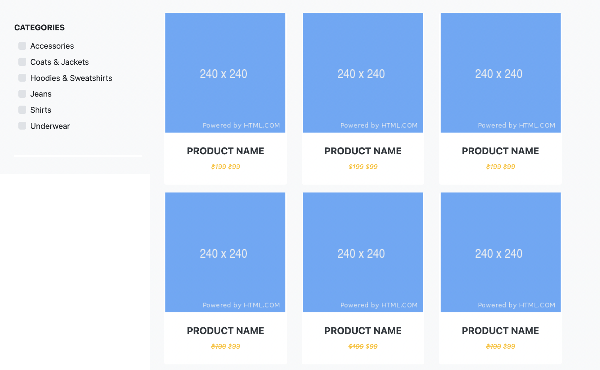
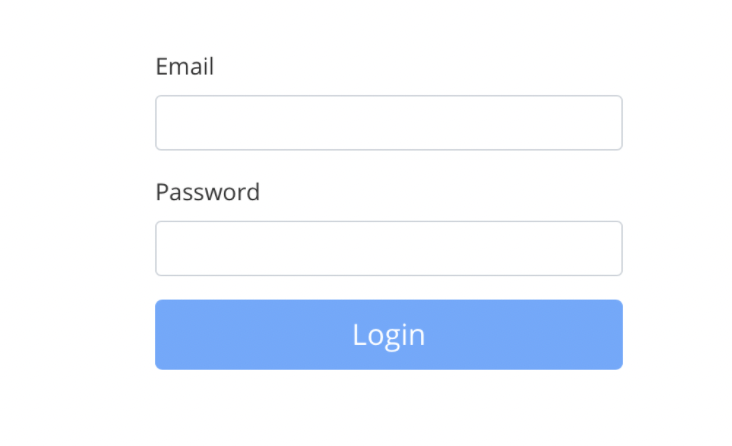
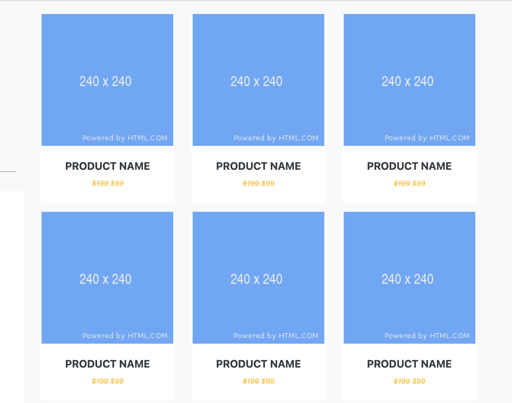

# ShopOnline

**ShopOnline** is an online mini e-commerce website that will provide users with varieties of product (such as headphones, computers, Cloth, and so on) to purchase, but no actual payment will be done. It has different categories of product which users can select. For example, categories might include *groceries, electronics, furniture, fashion,* and so on. Basically, this will be a mini version of the likes of ebay or amazon.

# Phase 1.
Create a login page that will give users access to the products.

# Instructions:
1. create an HTML form with two fields; **username** and **password**
2. Both username and password field must be filled before user can submit the form. You can do this by using the `required` attribute of the text field.
3. encode the password field so users will not see plain password while typing.
4. Don't put any restriction on the number of characters for user password.
5. create a `<button>` element and name it  *Login.*
6. users should be directed to the product page at the the click of the login button.
7. add css style to your page for better user experience
8. run the code to verify phase 1 has been completed.
9 

# Phase 2
This phase requires you create a product page where users can see the available products based on different product categories. There should be a menu at the left-side of the page to display different product categories. So this phase is all about building side menu.

# Instructions:
1.  Divide the page into two rows; one for **page headings** and the other for the **body of the page** .
2.  Further divide the **body** into two; *left-side menu* and *main page* for product display. The main page will be developed in the next phase.
3.  create the product categories such as *Fashion, Furnitures, Electronics, and Groceries.* **Hint: **Use the list element `<li></li>` for each category.
4.  create an *hyperlink* on each category using `.` for example, Groceries will look like `<i><a href="groceries">Groceries</a></li>`.
5.  Style the menus as much as you like.

# Phase 3
In this phase, you will create the body of the product page where each product will be displayed. 

# Instructions:
1. Create a container to house all the product display.
2. In your container, create  240x240 card to display a product.
3. Duplicate the card 2 times so that you have 3 cards altogether, and all on the same row.
4. In each container, display the product image, name, and price.
5. Carry out step 3 and 4 on another row so you have 2 rows of product.
6. Run your code to verify all instruction in this phase has been completed.
7. Did your product page have the same structure like above? If not, check out the instructions once again. 

# Phase 4
The last phase is to connect phase 2 to phase 3. So  when you click on a project category, all products in that category will be displayed in the main product section you developed in phase 3.

# Instruction:
1. 